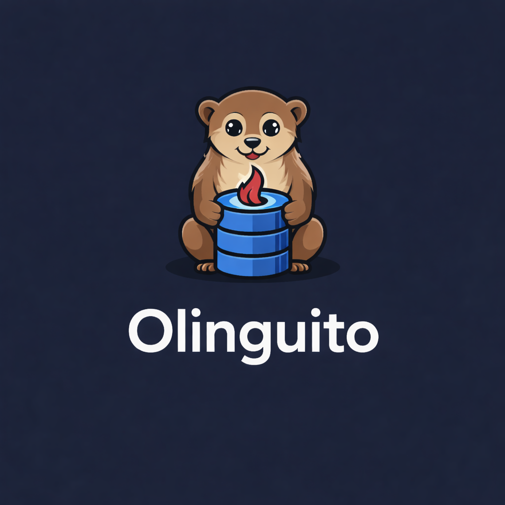

# SiteNetSoft Olinguito — OData V4
<p align="center">
  
</p>
Based on Apache Olingo, a Java library and extensions around the OData specification.

Apache Olingo supported the specification version:
- OData 4.0 <http://www.odata.org/documentation/odata-version-4-0/>

## Upstream / affiliation
Olinguito is a community-maintained fork of Apache Olingo.
This project is not affiliated with the Apache Software Foundation.

## Building
You can build SiteNetSoft Olinguito like this:

```bash
mvn -B -DskipTests=false test
```

You need Maven 3.9+ with Java 17+ (or higher) for the build.

## Documentation
Upstream documentation from Apache Olingo is available at:
http://olingo.apache.org/

Project-specific documentation for Olinguito will be added here as the fork evolves.

## License (see also package specific LICENSE files)
This project is a derivative work based on Apache Olingo and retains the original Apache License and notices.

Collective work: Copyright 2014 The Apache Software Foundation.

Licensed to the Apache Software Foundation (ASF) under one or more
contributor license agreements.  See the NOTICE file distributed with
this work for additional information regarding copyright ownership.
The ASF licenses this file to You under the Apache License, Version 2.0
(the "License"); you may not use this file except in compliance with
the License.  You may obtain a copy of the License at

     http://www.apache.org/licenses/LICENSE-2.0

Unless required by applicable law or agreed to in writing, software
distributed under the License is distributed on an "AS IS" BASIS,
WITHOUT WARRANTIES OR CONDITIONS OF ANY KIND, either express or implied.
See the License for the specific language governing permissions and
limitations under the License.

## Dependencies with "Weak Copyleft" or dual licenses
SiteNetSoft Olinguito uses some libraries with open source licenses that require reciprocal
licensing when modified. These libraries are included in unmodified binary
form and can be redistributed under terms that are compatible with the
Apache License.

Some libraries used by SiteNetSoft Olinguito are dual-licensed under different open source
licenses. These libraries are redistributed under the license whose terms
are compatible with the Apache License.

See LICENSE file included in all SiteNetSoft Olinguito packages for 
full licensing details.